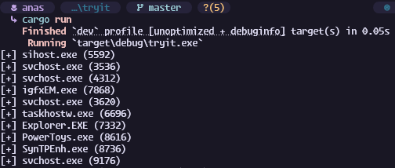

# 🧠 Process Enumeration (Rust)



This is a simple Rust project that uses Windows API to interact with running processes.

## 🛠️ How to Use

1. Make sure you’re on **Windows**.
  
2. Run the project:
  

```bash
cargo run --release
```

## 📦 Dependency

In your `Cargo.toml`:

```toml
[dependencies]
winapi = { version = "0.3.9", features = ["psapi", "processthreadsapi", "winnt"] }
```
